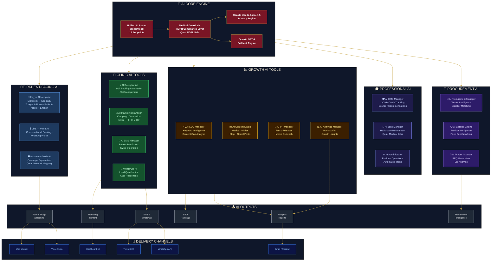
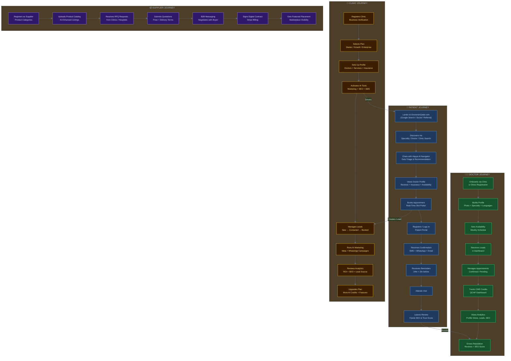
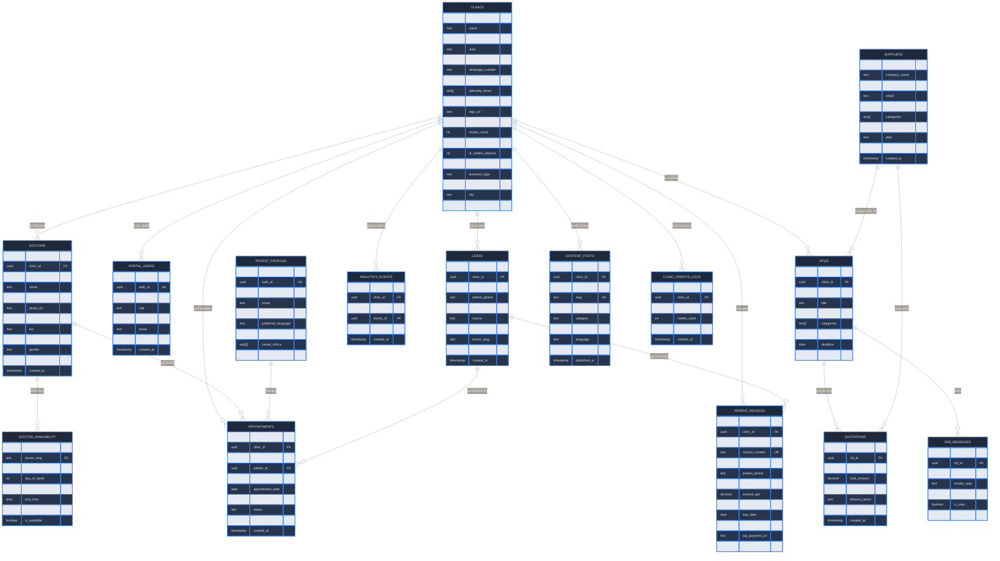
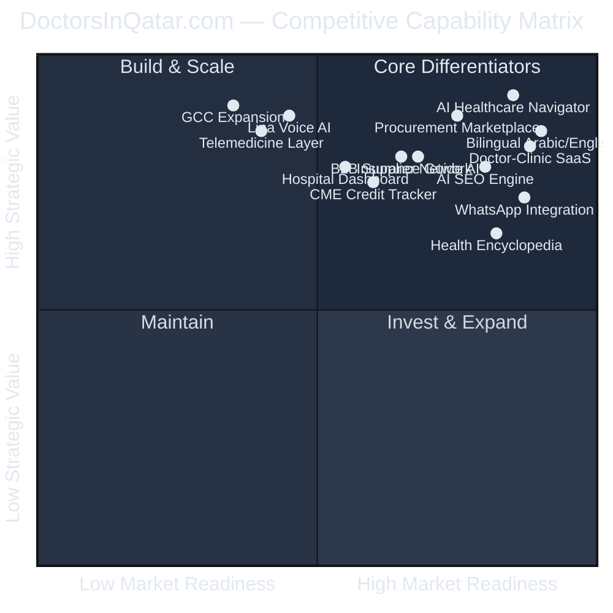

# DoctorsInQatar.com — Enterprise Architecture Diagrams
**AI Healthcare Growth Operating System — Qatar & GCC**
*Version 2.0 | June 2026 | For Investors, QSTP, Rasmal Ventures, Healthcare Stakeholders*

---

## DIAGRAM 1 — Executive Architecture Overview

```mermaid
%%{init: {'theme': 'base', 'themeVariables': {'primaryColor': '#7a1525', 'primaryTextColor': '#fff', 'primaryBorderColor': '#c9a84c', 'lineColor': '#c9a84c', 'secondaryColor': '#1a1a2e', 'tertiaryColor': '#16213e', 'background': '#0d0d0d', 'mainBkg': '#1a1a2e', 'nodeBorder': '#c9a84c', 'clusterBkg': '#16213e', 'titleColor': '#c9a84c', 'edgeLabelBackground': '#1a1a2e', 'fontFamily': 'Inter, sans-serif'}}}%%

graph TB
    subgraph USERS["👥 USER ECOSYSTEM"]
        P["🏥 Patients<br/>Discovery & Booking"]
        D["👨‍⚕️ Doctors<br/>Profile & Leads"]
        C["🏢 Clinics<br/>Growth & Management"]
        H["🏨 Hospitals<br/>Network & Referrals"]
        S["📦 Suppliers<br/>B2B Marketplace"]
        PH["💊 Pharmacies"]
        HC["🏠 Home Care"]
    end

    subgraph PUBLIC["🌐 PUBLIC DISCOVERY LAYER"]
        HP["Homepage"]
        DP["Doctor Profiles"]
        CP["Clinic Profiles"]
        SP["Specialty Pages (40+)"]
        ENC["Health Encyclopedia<br/>180+ Articles"]
        INS["Insurance Guide"]
        PSEO["Programmatic SEO<br/>1000+ Pages"]
        AR["Arabic Site /ar/*<br/>Full RTL Localization"]
    end

    subgraph AI_SUITE["🤖 HAYYA MED AI SUITE"]
        NAV["🧭 Hayya AI Navigator<br/>Patient Triage"]
        REC["📞 AI Receptionist<br/>Booking & Scheduling"]
        MKT["📣 AI Marketing Manager<br/>Campaigns & Copy"]
        SEO_AI["🔍 AI SEO Manager<br/>Rankings & Keywords"]
        CON["✍️ AI Content Studio<br/>Articles & Posts"]
        PR["📰 AI PR Manager<br/>Press & Brand"]
        SMS["💬 AI SMS Manager<br/>Reminders & Alerts"]
        ANA["📊 AI Analytics Manager<br/>Insights & Reports"]
        ADM["⚙️ AI Administrator<br/>Operations"]
        LINA["🎙️ Lina — AI Voice<br/>Arabic & English"]
        CME["🎓 AI CME Manager<br/>QCHP Credits"]
        PROC_AI["🛒 AI Procurement<br/>Tender Intelligence"]
    end

    subgraph DASHBOARDS["📱 DASHBOARD LAYER"]
        PATIENT_D["Patient Portal<br/>12 Pages"]
        CLINIC_D["Clinic Dashboard<br/>30 Pages"]
        DOCTOR_D["Doctor Dashboard<br/>Profile & Analytics"]
        HOSPITAL_D["Hospital Dashboard"]
        ADMIN_D["Master Admin<br/>Platform Control"]
        SUPPLIER_D["Supplier Dashboard<br/>B2B & RFQ"]
    end

    subgraph MARKETPLACE["🛒 PROCUREMENT MARKETPLACE"]
        RFQ["RFQ System"]
        QUOT["Quotation Engine"]
        B2B["B2B Messaging"]
        CATALOG["Product Catalog"]
        COMPARE["Comparison Engine"]
        CONTRACT["Contracts & Billing"]
    end

    subgraph BACKEND["⚙️ BACKEND PLATFORM"]
        NEXTJS["Next.js 15 App Router<br/>TypeScript Strict"]
        SUPA["Supabase<br/>Postgres + Auth + Storage"]
        EDGE["Edge Functions<br/>AI Routing"]
        API["REST API v1<br/>Public Endpoints"]
    end

    subgraph INTEGRATIONS["🔌 INTEGRATIONS"]
        CLAUDE_API["Anthropic Claude"]
        OPENAI["OpenAI GPT-4"]
        WA["WhatsApp Business API"]
        TWILIO["Twilio SMS"]
        STRIPE["Stripe Billing"]
        TAP["Tap Payments<br/>Qatar Local"]
        MAPS["Google Maps"]
        GA4["Google Analytics 4"]
    end

    subgraph INFRA["☁️ INFRASTRUCTURE"]
        VERCEL["Vercel<br/>Edge Network"]
        CDN["Global CDN"]
        MON["Monitoring & Alerts"]
        BAK["Automated Backups"]
    end

    USERS --> PUBLIC
    USERS --> DASHBOARDS
    PUBLIC --> AI_SUITE
    DASHBOARDS --> AI_SUITE
    AI_SUITE --> BACKEND
    DASHBOARDS --> MARKETPLACE
    MARKETPLACE --> BACKEND
    BACKEND --> INTEGRATIONS
    BACKEND --> INFRA

    classDef userNode fill:#7a1525,stroke:#c9a84c,color:#fff,font-weight:bold
    classDef aiNode fill:#1a1a2e,stroke:#c9a84c,color:#c9a84c,font-weight:bold
    classDef infraNode fill:#0d2137,stroke:#3b82f6,color:#93c5fd
    classDef pubNode fill:#14532d,stroke:#22c55e,color:#bbf7d0
    classDef dashNode fill:#3b1f00,stroke:#f59e0b,color:#fde68a
    classDef mktNode fill:#1e1b4b,stroke:#818cf8,color:#c7d2fe

    class P,D,C,H,S,PH,HC userNode
    class NAV,REC,MKT,SEO_AI,CON,PR,SMS,ANA,ADM,LINA,CME,PROC_AI aiNode
    class VERCEL,CDN,MON,BAK infraNode
    class HP,DP,CP,SP,ENC,INS,PSEO,AR pubNode
    class PATIENT_D,CLINIC_D,DOCTOR_D,HOSPITAL_D,ADMIN_D,SUPPLIER_D dashNode
    class NEXTJS,SUPA,EDGE,API mktNode
```

---

## DIAGRAM 2 — Technical System Architecture

```mermaid
%%{init: {'theme': 'base', 'themeVariables': {'primaryColor': '#1e293b', 'primaryTextColor': '#e2e8f0', 'primaryBorderColor': '#3b82f6', 'lineColor': '#64748b', 'secondaryColor': '#0f172a', 'tertiaryColor': '#1e293b', 'fontFamily': 'Inter, sans-serif', 'fontSize': '13px'}}}%%

graph LR
    subgraph CLIENT["CLIENT LAYER"]
        direction TB
        BROWSER["🌐 Browser / PWA<br/>React 19 + Tailwind v4"]
        MOBILE["📱 Mobile Web<br/>Responsive + PWA"]
        SW["⚡ Service Worker<br/>Offline Support"]
    end

    subgraph NEXT["NEXT.JS 15 APP ROUTER"]
        direction TB
        subgraph ROUTES["Page Routes"]
            PUB_R["Public Routes<br/>/doctors /clinics /specialties<br/>/health-encyclopedia /ar/*"]
            DASH_R["Dashboard Routes<br/>/dashboard/* (30 pages)"]
            PAT_R["Patient Routes<br/>/patient/* (12 pages)"]
            API_R["API Routes<br/>/api/* + REST v1"]
        end
        subgraph MW["Middleware & Config"]
            AUTH_MW["Auth Middleware<br/>Coming Soon Gate"]
            NEXT_CFG["next.config.ts<br/>Image Domains, Rewrites"]
            SITEMAP["sitemap.ts<br/>1000+ Dynamic URLs"]
        end
    end

    subgraph AI_ROUTER["AI ROUTING LAYER"]
        direction TB
        UNIFIED["Unified AI Router<br/>/api/ai/[tool]"]
        GUARD["ai-guardrails.ts<br/>Medical Safety Layer"]
        subgraph AI_TOOLS["15 AI Tool Endpoints"]
            T1["navigator"] 
            T2["receptionist"]
            T3["marketing"]
            T4["seo_manager"]
            T5["content_studio"]
            T6["pr_manager"]
            T7["sms_manager"]
            T8["analytics"]
            T9["administrator"]
            T10["voice_lina"]
            T11["cme_manager"]
            T12["procurement"]
            T13["jobs"]
            T14["insurance_guide"]
            T15["secretary"]
        end
    end

    subgraph SUPABASE["SUPABASE PLATFORM"]
        direction TB
        subgraph DB["PostgreSQL Database"]
            CLINIC_T["clinics"]
            DOCTOR_T["doctors"]
            LEAD_T["leads"]
            PATIENT_T["patient_profiles"]
            AVAIL_T["doctor_availability"]
            INV_T["patient_invoices"]
            ANALYTICS_T["analytics_events"]
            CONTENT_T["content_posts"]
            PROC_T["procurement tables (12)"]
        end
        AUTH["Auth<br/>JWT + RLS Policies"]
        STORAGE["Storage<br/>Photos + Documents"]
        REALTIME["Realtime<br/>B2B Chat + Notifs"]
        EDGE_FN["Edge Functions<br/>Webhooks + Cron"]
    end

    subgraph EXT_AI["EXTERNAL AI PROVIDERS"]
        CLAUDE["Anthropic Claude<br/>claude-haiku-4-5<br/>Primary Engine"]
        OAI["OpenAI GPT-4<br/>Fallback Engine"]
    end

    subgraph EXT_SVC["EXTERNAL SERVICES"]
        WA_SVC["WhatsApp Business API"]
        TWI["Twilio SMS<br/>+ Webhook Verify"]
        STRIPE_SVC["Stripe<br/>Subscription Billing"]
        TAP_SVC["Tap Payments<br/>Qatar Gateway<br/>+ HMAC Webhook"]
        MAPS_SVC["Google Maps<br/>Location Services"]
        RESEND["Resend<br/>Transactional Email"]
    end

    subgraph INFRA_TECH["DEPLOYMENT"]
        VER["Vercel<br/>Edge Network"]
        CDN_T["CDN + Image Optimization"]
        DNS_T["DNS + SSL"]
        MON_T["Monitoring + Alerts"]
    end

    CLIENT --> NEXT
    NEXT --> AI_ROUTER
    NEXT --> SUPABASE
    AI_ROUTER --> EXT_AI
    AI_ROUTER --> EXT_SVC
    SUPABASE --> EXT_SVC
    NEXT --> INFRA_TECH

    UNIFIED --> GUARD
    GUARD --> T1
    GUARD --> T3
    GUARD --> T5

    classDef techBlue fill:#1e3a5f,stroke:#3b82f6,color:#93c5fd,font-weight:bold
    classDef techGreen fill:#14532d,stroke:#22c55e,color:#bbf7d0
    classDef techPurple fill:#2e1065,stroke:#a855f7,color:#d8b4fe
    classDef techOrange fill:#431407,stroke:#f97316,color:#fed7aa
    classDef techRed fill:#450a0a,stroke:#ef4444,color:#fca5a5

    class BROWSER,MOBILE,SW techBlue
    class CLAUDE,OAI techPurple
    class CLINIC_T,DOCTOR_T,LEAD_T,PATIENT_T,AVAIL_T,INV_T,ANALYTICS_T,CONTENT_T,PROC_T techGreen
    class WA_SVC,TWI,STRIPE_SVC,TAP_SVC,MAPS_SVC,RESEND techOrange
    class VER,CDN_T,DNS_T,MON_T techRed
```

---

## DIAGRAM 3 — AI Ecosystem Architecture

---

## DIAGRAM 4 — User Journey Architecture

---

## DIAGRAM 5 — Database Entity Relationship Diagram

---

## DIAGRAM 6 — Revenue Flow Architecture

```mermaid
%%{init: {'theme': 'base', 'themeVariables': {'primaryColor': '#14532d', 'primaryTextColor': '#bbf7d0', 'primaryBorderColor': '#22c55e', 'lineColor': '#4ade80', 'secondaryColor': '#0f172a', 'fontFamily': 'Inter, sans-serif', 'fontSize': '12px'}}}%%

flowchart LR
    subgraph REVENUE_SOURCES["💰 REVENUE STREAMS"]
        direction TB
        R1["📅 SaaS Subscriptions<br/>Clinics / Hospitals<br/>Starter · Growth · Enterprise<br/>QAR 299–1,999/mo"]
        R2["🤖 AI Credits<br/>Pay-per-use<br/>Above plan quota<br/>QAR 0.50–2.00/credit"]
        R3["📦 Supplier Marketplace<br/>Annual Listing Fees<br/>Featured Placement<br/>QAR 2,500–15,000/yr"]
        R4["💊 Featured Listings<br/>Pharmacy · Home Care<br/>Physio · Nutrition<br/>Premium Placement"]
        R5["📣 Digital Advertising<br/>Sponsored Content<br/>Banner Ads · Newsletter<br/>Performance Campaigns"]
        R6["🤝 B2B Commissions<br/>Procurement Deals<br/>Referral Fees<br/>2–5% of contract"]
        R7["📊 Data Intelligence<br/>Market Reports<br/>Healthcare Analytics<br/>Enterprise Insights"]
        R8["🏥 Hospital Contracts<br/>Network Agreements<br/>Custom Integrations<br/>QAR 50,000+/yr"]
    end

    subgraph PAYMENT_GATEWAYS["💳 PAYMENT GATEWAYS"]
        STRIPE_R["Stripe<br/>Global Subscriptions<br/>Cards + Bank Transfer"]
        TAP_R["Tap Payments<br/>Qatar Local<br/>MADA + KNET + QR"]
        BANK["Bank Transfer<br/>Enterprise Clients<br/>Purchase Orders"]
    end

    subgraph SUBSCRIPTION_TIERS["📊 SUBSCRIPTION PLANS"]
        direction TB
        FREE_T["Free Tier<br/>Basic listing<br/>5 leads/mo<br/>No AI tools"]
        STARTER_T["Starter Plan<br/>QAR 299/mo<br/>50 AI credits<br/>Basic analytics"]
        GROWTH_T["Growth Plan<br/>QAR 799/mo<br/>200 AI credits<br/>Full AI suite"]
        ENTERPRISE_T["Enterprise Plan<br/>QAR 1,999/mo<br/>Unlimited AI<br/>Dedicated support"]
        SUPPLIER_T["Supplier Plans<br/>QAR 2,500–15,000/yr<br/>Marketplace access<br/>RFQ system"]
    end

    subgraph COST_CENTERS["⬇️ COST CENTERS"]
        direction TB
        AI_COST["AI API Costs<br/>Claude + OpenAI<br/>~QAR 0.10/call"]
        INFRA_COST["Infrastructure<br/>Vercel + Supabase<br/>~QAR 1,200/mo"]
        SMS_COST["SMS / WhatsApp<br/>Twilio + WA API<br/>Per message"]
        STRIPE_COST["Payment Processing<br/>Stripe: 2.9% + 30¢<br/>Tap: 2.75%"]
        TEAM_COST["Team & Operations<br/>Engineering + CS<br/>Growth"]
    end

    subgraph UNIT_ECONOMICS["📈 UNIT ECONOMICS"]
        direction TB
        LTV["Clinic LTV<br/>Avg 18-mo retention<br/>QAR 8,500 LTV"]
        CAC["Customer Acquisition<br/>SEO + Content driven<br/>QAR 350 CAC"]
        GM["Gross Margin<br/>Target 72%+<br/>SaaS model"]
        MRR["MRR Target<br/>Year 1: QAR 150K<br/>Year 3: QAR 800K"]
    end

    R1 --> STRIPE_R
    R2 --> STRIPE_R
    R2 --> TAP_R
    R3 --> STRIPE_R
    R3 --> BANK
    R4 --> STRIPE_R
    R5 --> BANK
    R6 --> STRIPE_R
    R7 --> BANK
    R8 --> BANK

    STRIPE_R --> SUBSCRIPTION_TIERS
    TAP_R --> SUBSCRIPTION_TIERS
    BANK --> SUBSCRIPTION_TIERS

    SUBSCRIPTION_TIERS --> UNIT_ECONOMICS
    UNIT_ECONOMICS --> COST_CENTERS

    classDef revenueNode fill:#14532d,stroke:#22c55e,color:#bbf7d0,font-weight:bold
    classDef gatewayNode fill:#1e3a5f,stroke:#60a5fa,color:#bfdbfe,font-weight:bold
    classDef tierNode fill:#3b1f00,stroke:#fbbf24,color:#fde68a
    classDef costNode fill:#450a0a,stroke:#ef4444,color:#fca5a5
    classDef econNode fill:#1e1b4b,stroke:#818cf8,color:#c7d2fe,font-weight:bold

    class R1,R2,R3,R4,R5,R6,R7,R8 revenueNode
    class STRIPE_R,TAP_R,BANK gatewayNode
    class FREE_T,STARTER_T,GROWTH_T,ENTERPRISE_T,SUPPLIER_T tierNode
    class AI_COST,INFRA_COST,SMS_COST,STRIPE_COST,TEAM_COST costNode
    class LTV,CAC,GM,MRR econNode
```

---

## DIAGRAM 7 — Integration & Data Flow Architecture

```mermaid
%%{init: {'theme': 'base', 'themeVariables': {'primaryColor': '#1e293b', 'primaryTextColor': '#e2e8f0', 'primaryBorderColor': '#c9a84c', 'lineColor': '#64748b', 'fontFamily': 'Inter, sans-serif', 'fontSize': '11px'}}}%%

flowchart TB
    subgraph CORE_PLATFORM["🏗️ CORE PLATFORM — DoctorsInQatar.com"]
        direction LR
        NEXT_CORE["Next.js 15 App Router"]
        SUPA_CORE["Supabase Platform"]
        AI_CORE["AI Router Layer"]
        NEXT_CORE <--> SUPA_CORE
        NEXT_CORE <--> AI_CORE
    end

    subgraph AI_PROVIDERS["🤖 AI INTELLIGENCE"]
        ANTHROPIC["Anthropic Claude<br/>claude-haiku-4-5-20251001<br/>Medical Guardrails Active"]
        OPENAI_I["OpenAI GPT-4<br/>Fallback Provider<br/>Content & Analysis"]
        ANTHROPIC -->|"Primary"| AI_CORE
        OPENAI_I -->|"Fallback"| AI_CORE
    end

    subgraph COMMUNICATION["📡 COMMUNICATION CHANNELS"]
        WA_I["WhatsApp Business API<br/>Booking Confirmations<br/>Lead Notifications<br/>AI Conversations"]
        TWILIO_I["Twilio SMS<br/>Appointment Reminders<br/>OTP + Alerts<br/>Webhook Verified"]
        EMAIL_I["Resend Email<br/>Transactional<br/>Invoices + Confirmations"]
        PUSH_I["Web Push Notifications<br/>Service Worker<br/>Real-time Alerts"]
    end

    subgraph PAYMENTS["💳 PAYMENT ECOSYSTEM"]
        STRIPE_I["Stripe<br/>SaaS Subscriptions<br/>AI Credit Purchases<br/>Supplier Plans"]
        TAP_I["Tap Payments<br/>Qatar Local Gateway<br/>MADA · KNET · Apple Pay<br/>HMAC Webhook Verified"]
    end

    subgraph ANALYTICS["📊 ANALYTICS & SEO"]
        GA4_I["Google Analytics 4<br/>User Behavior<br/>Conversion Tracking<br/>Arabic + English"]
        GSC_I["Google Search Console<br/>SEO Performance<br/>1000+ Page Sitemap"]
        META_I["Meta Pixel<br/>Facebook + Instagram<br/>Retargeting Campaigns"]
        TIKTOK_I["TikTok Pixel<br/>GCC Audience<br/>Healthcare Campaigns"]
    end

    subgraph MAPS_LOC["📍 LOCATION SERVICES"]
        GMAPS_I["Google Maps API<br/>Clinic Locations<br/>Area-based Search<br/>Doha Neighborhoods"]
    end

    subgraph HOSTING_I["☁️ INFRASTRUCTURE"]
        VERCEL_I["Vercel Edge Network<br/>Global CDN<br/>SSL + DDoS Protection<br/>Auto-scaling"]
        SUPABASE_INFRA["Supabase Cloud<br/>Managed Postgres<br/>Row Level Security<br/>Real-time Subscriptions"]
    end

    CORE_PLATFORM <-->|"AI Requests"| AI_PROVIDERS
    CORE_PLATFORM -->|"SMS + Reminders"| TWILIO_I
    CORE_PLATFORM -->|"Booking Alerts"| WA_I
    CORE_PLATFORM -->|"Invoices"| EMAIL_I
    CORE_PLATFORM -->|"Push Notifs"| PUSH_I
    CORE_PLATFORM <-->|"Billing"| STRIPE_I
    CORE_PLATFORM <-->|"Qatar Payments"| TAP_I
    CORE_PLATFORM -->|"Events"| GA4_I
    CORE_PLATFORM -->|"Indexes"| GSC_I
    CORE_PLATFORM -->|"Conversions"| META_I
    CORE_PLATFORM -->|"Conversions"| TIKTOK_I
    CORE_PLATFORM -->|"Location Queries"| GMAPS_I
    CORE_PLATFORM ---|"Deployed on"| VERCEL_I
    CORE_PLATFORM ---|"Data on"| SUPABASE_INFRA

    classDef coreClass fill:#7a1525,stroke:#c9a84c,color:#fff,font-weight:bold
    classDef aiClass fill:#2d1b69,stroke:#a78bfa,color:#ddd6fe
    classDef commClass fill:#14532d,stroke:#22c55e,color:#bbf7d0
    classDef payClass fill:#1e3a5f,stroke:#60a5fa,color:#bfdbfe
    classDef anaClass fill:#3b1f00,stroke:#fbbf24,color:#fde68a
    classDef infraClass fill:#0f172a,stroke:#475569,color:#94a3b8

    class NEXT_CORE,SUPA_CORE,AI_CORE coreClass
    class ANTHROPIC,OPENAI_I aiClass
    class WA_I,TWILIO_I,EMAIL_I,PUSH_I commClass
    class STRIPE_I,TAP_I payClass
    class GA4_I,GSC_I,META_I,TIKTOK_I anaClass
    class GMAPS_I,VERCEL_I,SUPABASE_INFRA infraClass
```

---

## DIAGRAM 8 — Platform Capability Matrix

---

## ARCHITECTURE SUMMARY — Layer Definitions

### Layer 1 — Public Website Layer
The discovery engine. Built with **Next.js 15 App Router** for maximum SEO performance. Includes 40+ specialty pages, doctor and clinic profiles, a 180+ article health encyclopedia, and programmatic SEO generating 1,000+ indexed pages. **Full Arabic localization** across 23 `/ar/*` routes with RTL support via Cairo font. All pages are MOPH-compliant (no comparative claims) and Qatar PDPL privacy-safe.

### Layer 2 — Patient Layer
12-page patient portal with appointment booking via real-time slot picker, saved providers, notification center (SMS + push), and the **Hayya AI Navigator** — an AI triage chatbot routing patients to the right specialty with medical guardrails.

### Layer 3 — Doctor Dashboard
Profile management, live availability editor, lead inbox, appointment tracker, QCHP CME credit tracker, and AI-generated SEO score with improvement recommendations.

### Layer 4 — Clinic Dashboard
30-page SaaS dashboard: doctor roster management, AI marketing suite, lead pipeline (New→Contacted→Booked→Completed), WhatsApp integration, invoicing with Tap Payments, and 5 AI analytics scores.

### Layer 5 — Master Admin Dashboard
Platform-wide control: user management, content approval queue, SEO management, AI tool configuration, subscription plan management, and Stripe billing oversight.

### Layer 6 — AI Layer
12 AI modules powered by **Claude claude-haiku-4-5** (primary) with OpenAI GPT-4 fallback. All routes pass through `ai-guardrails.ts` enforcing MOPH medical compliance, no-diagnosis rules, and emergency referral protocols.

### Layer 7 — Procurement Marketplace
Healthcare B2B marketplace: clinics and hospitals post RFQs, suppliers respond with quotations, B2B messaging, digital contract signing, and Stripe billing for supplier subscriptions.

### Layer 8 — Integration Layer
14 external integrations: AI (Claude + OpenAI), Communication (Twilio + WhatsApp + Resend), Payments (Stripe + Tap), Analytics (GA4 + GSC + Meta + TikTok), Location (Google Maps).

### Layer 9 — Backend Layer
Next.js 15 + TypeScript strict mode + Tailwind v4 + Supabase (Postgres + Auth + Storage + Realtime + Edge Functions). Row Level Security enforced on all tables. Admin client bypasses RLS for API mutations only.

### Layer 10 — Infrastructure Layer
Vercel edge network with global CDN, automated SSL, DDoS protection, and auto-scaling. Supabase managed cloud for database. Monitoring and automated daily backups.

---

*Generated: June 2026 | DoctorsInQatar.com | Hayya Med Technology*
*Classification: Investor-Ready Architecture Document*
