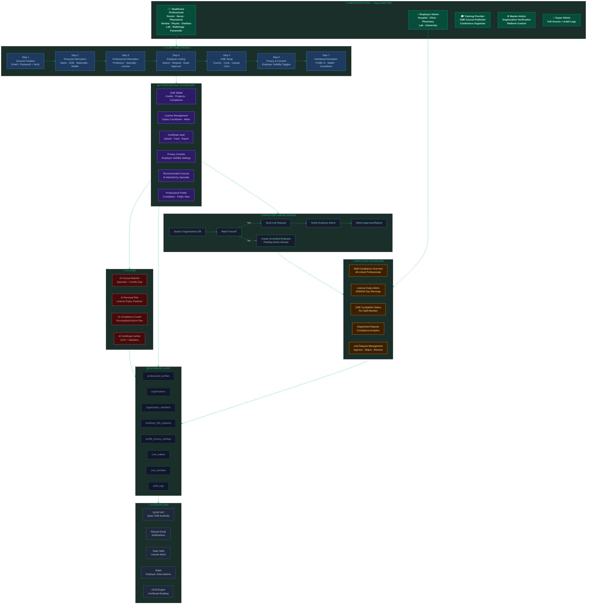
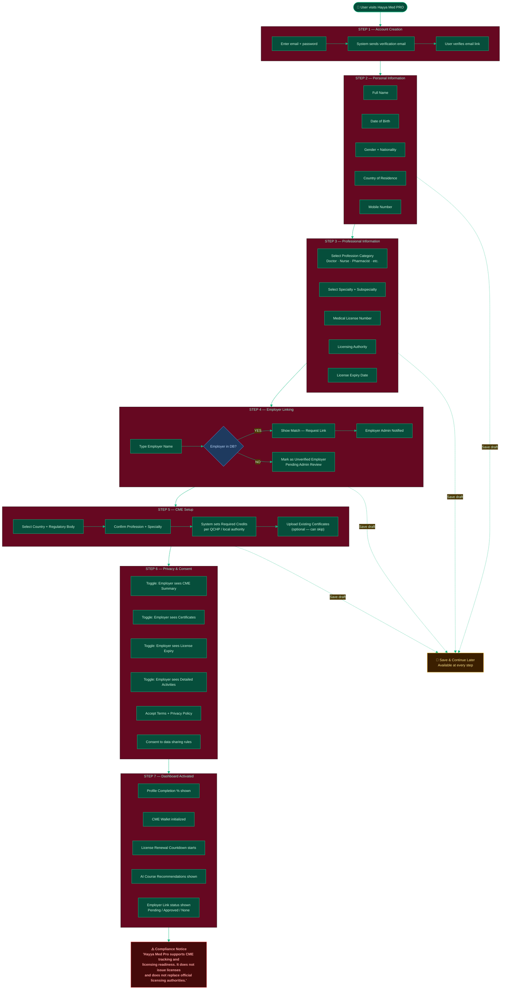
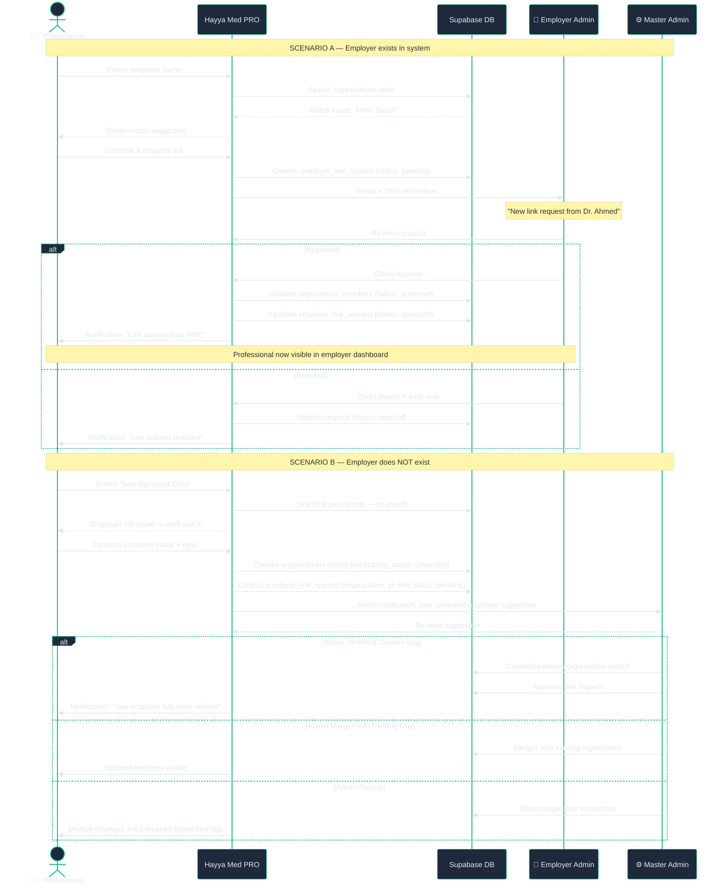
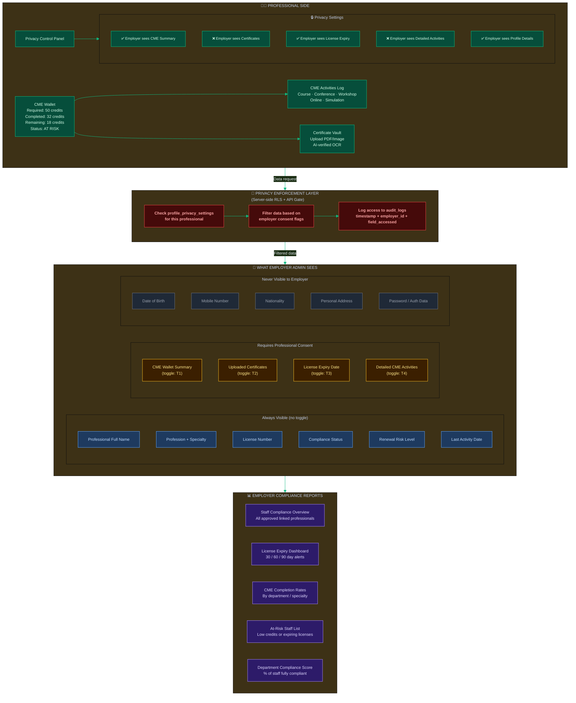
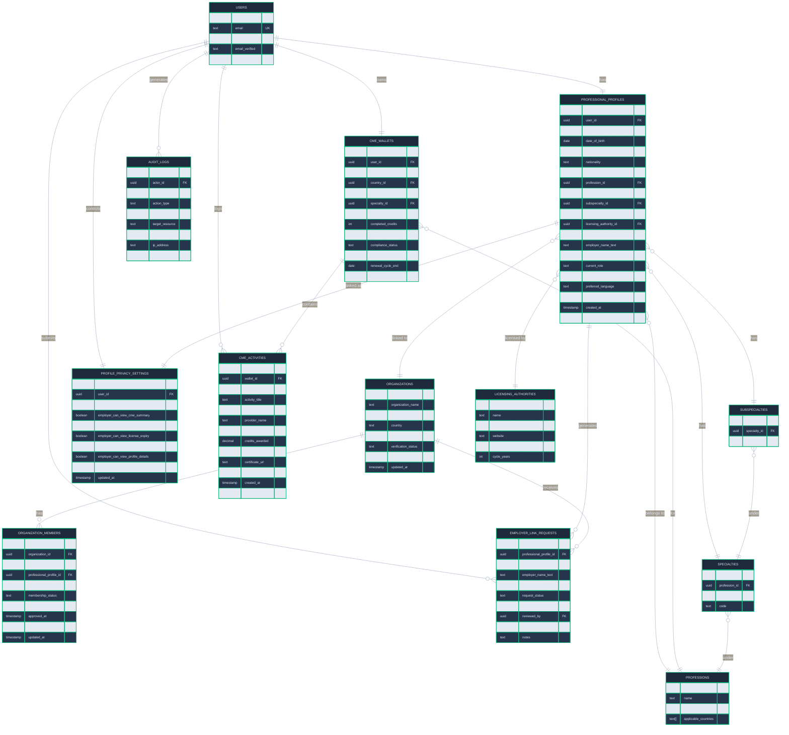
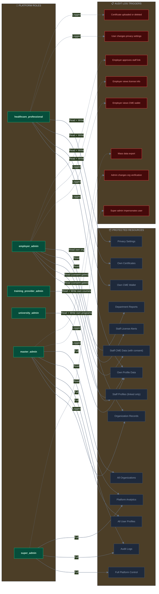
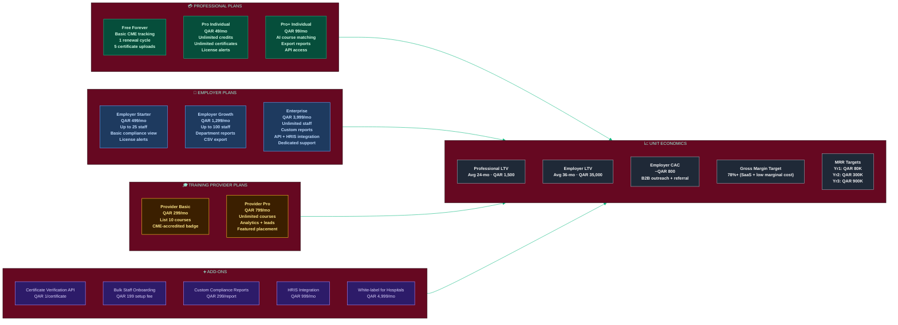
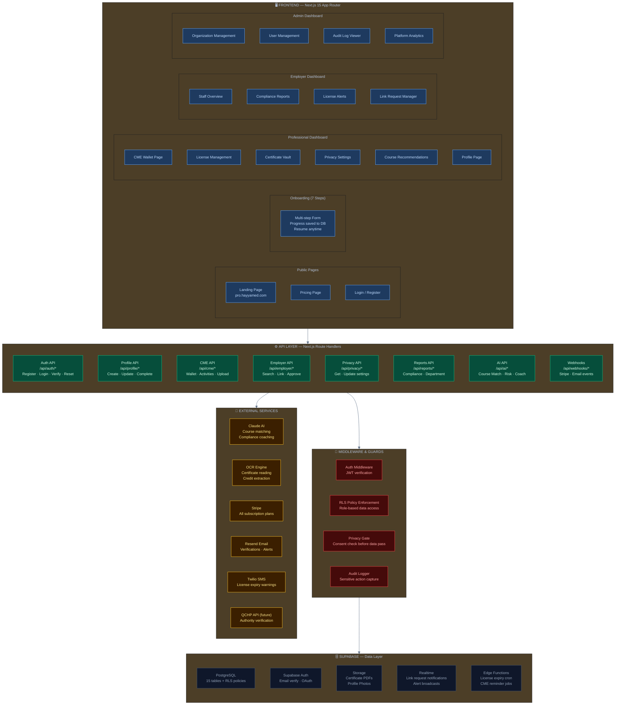

# Hayya Med PRO — Complete System Architecture
**Healthcare Professional CME & Compliance Operating System — Qatar & GCC**
*Version 1.0 | June 2026 | Project 4*

---

## DIAGRAM 1 — Executive Platform Overview



---

## DIAGRAM 2 — 7-Step Onboarding Flow



---

## DIAGRAM 3 — Employer Linking & Approval Workflow



---

## DIAGRAM 4 — CME Wallet & Privacy Architecture



---

## DIAGRAM 5 — Database ERD



---

## DIAGRAM 6 — Role-Based Access Control



---

## DIAGRAM 7 — Revenue & Business Model



---

## DIAGRAM 8 — Technical Architecture



---

## IMPLEMENTATION ROADMAP

### Phase 1 — Foundation (Week 1–2)
**Database & Auth**
- [ ] Create Supabase project: `hayyamed-pro`
- [ ] Run all 15 table migrations with RLS policies
- [ ] Set up role enum + auth triggers
- [ ] Configure storage buckets (certificates, profile-photos)

**Onboarding Flow**
- [ ] 7-step form with localStorage + DB draft saving
- [ ] Email verification flow
- [ ] Profession → Specialty → Subspecialty cascading dropdowns
- [ ] Progress bar + step validation

### Phase 2 — Core Features (Week 3–4)
**Professional Dashboard**
- [ ] CME Wallet UI (donut chart, progress bar, credits breakdown)
- [ ] Certificate upload (drag & drop, PDF preview, OCR processing)
- [ ] License countdown (days remaining, color-coded risk)
- [ ] Privacy settings control panel

**Employer Linking**
- [ ] Organization search with fuzzy match
- [ ] Link request flow (send → notify → approve/reject)
- [ ] Unverified employer suggestion flow
- [ ] Real-time notification via Supabase Realtime

### Phase 3 — Employer Dashboard (Week 5–6)
- [ ] Staff compliance overview table
- [ ] Privacy-gated data rendering (check consent flags server-side)
- [ ] License expiry alerts (30/60/90 day dashboard cards)
- [ ] Department-level compliance report
- [ ] CSV export for HR teams

### Phase 4 — AI & Intelligence (Week 7–8)
- [ ] AI course matcher (Claude API — specialty + credits gap → recommendations)
- [ ] AI renewal risk predictor (license expiry + credit velocity)
- [ ] AI compliance coach (personalized action plan)
- [ ] OCR certificate reader (extract credits, dates, provider)

### Phase 5 — Billing & Admin (Week 9–10)
- [ ] Stripe integration (individual + employer plans)
- [ ] Master admin dashboard (org verification, user management)
- [ ] Audit log viewer (super admin only)
- [ ] Cron jobs: license expiry emails (90/60/30/7 days)

---

## SQL MIGRATIONS — Quick Reference

```sql
-- Core lookup tables
CREATE TABLE professions (id uuid PRIMARY KEY DEFAULT gen_random_uuid(), name text NOT NULL, code text UNIQUE, applicable_countries text[]);
CREATE TABLE specialties (id uuid PRIMARY KEY DEFAULT gen_random_uuid(), profession_id uuid REFERENCES professions(id), name text NOT NULL, code text);
CREATE TABLE subspecialties (id uuid PRIMARY KEY DEFAULT gen_random_uuid(), specialty_id uuid REFERENCES specialties(id), name text NOT NULL);
CREATE TABLE licensing_authorities (id uuid PRIMARY KEY DEFAULT gen_random_uuid(), name text NOT NULL, country text, website text, required_cme_credits_per_cycle int, cycle_years int);

-- Core business tables
CREATE TABLE organizations (id uuid PRIMARY KEY DEFAULT gen_random_uuid(), organization_name text NOT NULL, organization_type text, country text, city text, verification_status text DEFAULT 'unverified', created_at timestamptz DEFAULT now(), updated_at timestamptz DEFAULT now());

CREATE TABLE professional_profiles (
  id uuid PRIMARY KEY DEFAULT gen_random_uuid(),
  user_id uuid REFERENCES auth.users(id) ON DELETE CASCADE,
  full_name text NOT NULL,
  date_of_birth date,
  gender text,
  nationality text,
  country_of_residence text,
  profession_id uuid REFERENCES professions(id),
  specialty_id uuid REFERENCES specialties(id),
  subspecialty_id uuid REFERENCES subspecialties(id),
  license_number text,
  licensing_authority_id uuid REFERENCES licensing_authorities(id),
  license_expiry_date date,
  employer_name_text text,
  employer_id uuid REFERENCES organizations(id),
  current_role text,
  years_of_experience int,
  preferred_language text DEFAULT 'en',
  profile_completion_percentage int DEFAULT 0,
  created_at timestamptz DEFAULT now(),
  updated_at timestamptz DEFAULT now()
);

CREATE TABLE organization_members (
  id uuid PRIMARY KEY DEFAULT gen_random_uuid(),
  organization_id uuid REFERENCES organizations(id),
  user_id uuid REFERENCES auth.users(id),
  professional_profile_id uuid REFERENCES professional_profiles(id),
  role_in_organization text,
  membership_status text DEFAULT 'pending' CHECK (membership_status IN ('pending','approved','rejected','removed')),
  approved_by uuid REFERENCES auth.users(id),
  approved_at timestamptz,
  created_at timestamptz DEFAULT now(),
  updated_at timestamptz DEFAULT now()
);

CREATE TABLE employer_link_requests (
  id uuid PRIMARY KEY DEFAULT gen_random_uuid(),
  professional_profile_id uuid REFERENCES professional_profiles(id),
  user_id uuid REFERENCES auth.users(id),
  employer_name_text text,
  organization_id uuid REFERENCES organizations(id),
  request_status text DEFAULT 'pending' CHECK (request_status IN ('pending','approved','rejected','cancelled')),
  requested_at timestamptz DEFAULT now(),
  reviewed_by uuid REFERENCES auth.users(id),
  reviewed_at timestamptz,
  notes text
);

CREATE TABLE profile_privacy_settings (
  id uuid PRIMARY KEY DEFAULT gen_random_uuid(),
  user_id uuid REFERENCES auth.users(id) ON DELETE CASCADE,
  professional_profile_id uuid REFERENCES professional_profiles(id),
  employer_can_view_cme_summary boolean DEFAULT true,
  employer_can_view_certificates boolean DEFAULT false,
  employer_can_view_license_expiry boolean DEFAULT true,
  employer_can_view_detailed_cme_activities boolean DEFAULT false,
  employer_can_view_profile_details boolean DEFAULT true,
  created_at timestamptz DEFAULT now(),
  updated_at timestamptz DEFAULT now()
);

CREATE TABLE cme_wallets (
  id uuid PRIMARY KEY DEFAULT gen_random_uuid(),
  user_id uuid REFERENCES auth.users(id),
  professional_profile_id uuid REFERENCES professional_profiles(id),
  country_id text,
  profession_id uuid REFERENCES professions(id),
  specialty_id uuid REFERENCES specialties(id),
  required_credits int DEFAULT 50,
  completed_credits int DEFAULT 0,
  remaining_credits int GENERATED ALWAYS AS (required_credits - completed_credits) STORED,
  compliance_status text DEFAULT 'pending',
  renewal_cycle_start date,
  renewal_cycle_end date,
  last_updated_at timestamptz DEFAULT now()
);

CREATE TABLE cme_activities (
  id uuid PRIMARY KEY DEFAULT gen_random_uuid(),
  wallet_id uuid REFERENCES cme_wallets(id),
  user_id uuid REFERENCES auth.users(id),
  activity_title text NOT NULL,
  activity_type text,
  provider_name text,
  country text,
  credits_awarded decimal(5,2),
  activity_date date,
  certificate_url text,
  verification_status text DEFAULT 'unverified',
  created_at timestamptz DEFAULT now(),
  updated_at timestamptz DEFAULT now()
);

CREATE TABLE audit_logs (
  id uuid PRIMARY KEY DEFAULT gen_random_uuid(),
  actor_id uuid REFERENCES auth.users(id),
  actor_role text,
  action_type text NOT NULL,
  target_user_id uuid REFERENCES auth.users(id),
  target_resource text,
  metadata jsonb,
  ip_address text,
  created_at timestamptz DEFAULT now()
);
```

---

## COMPLIANCE NOTICES

> **Platform Disclaimer (required on all pages):**
> "Hayya Med Pro supports CME tracking and licensing readiness. It does not issue licenses and does not replace official licensing authorities. Users must verify final requirements with their relevant regulatory body."

> **Data Protection:** Full compliance with Qatar PDPL Law No. 13/2016. All employer data access is consent-gated, logged, and auditable.

> **GCC Expansion:** Architecture supports multi-country regulatory bodies (QCHP Qatar, DHA Dubai, HAAD Abu Dhabi, SCFHS Saudi Arabia, MOH Kuwait).

---

*Generated: June 2026 | Hayya Med Technology | Project 4 — Hayya Med PRO*
*Classification: Internal Architecture + Investor Document*
