# Hayya Med Pro — Entity Relationship Diagram
_Generated: 2026-06-15 | Source of truth: supabase/migrations/001–040_

---

## Complete ERD (Mermaid)

```mermaid
erDiagram
    %% ── AUTH (Supabase managed) ─────────────────────────────────
    AUTH_USERS {
        uuid id PK
        text email
        timestamptz created_at
    }

    %% ── CORE IDENTITY ───────────────────────────────────────────
    professional_profiles {
        uuid id PK
        uuid auth_id FK
        text email
        text full_name
        date date_of_birth
        text nationality
        text country_of_residence
        text mobile
        text profession
        text specialty
        text subspecialty
        text license_number
        text licensing_authority
        date license_expiry
        smallint onboarding_step
        boolean onboarding_complete
        smallint profile_completion_pct
        text referral_code
        boolean email_cme_verified
        boolean email_cme_deadline
        boolean email_license_expiry
        boolean email_trial_reminders
        boolean email_employer_tasks
        boolean email_marketing
        timestamptz created_at
        timestamptz updated_at
    }

    %% ── ORGANISATIONS ───────────────────────────────────────────
    organizations {
        uuid id PK
        text name
        org_type type
        text country
        text city
        boolean verified
        timestamptz created_at
    }

    organization_members {
        uuid id PK
        uuid organization_id FK
        uuid auth_id FK
        user_role role
        text department
        timestamptz created_at
    }

    %% ── COMPLIANCE & CME ────────────────────────────────────────
    cme_wallets {
        uuid id PK
        uuid professional_id FK
        text country
        text profession
        text specialty
        integer required_credits
        integer completed_credits
        integer renewal_cycle_years
        date cycle_start_date
        date cycle_end_date
        compliance_status compliance_status
        boolean is_primary
        text label
        timestamptz updated_at
    }

    cme_activities {
        uuid id PK
        uuid wallet_id FK
        uuid professional_id FK
        text title
        text provider
        date activity_date
        numeric credits
        text certificate_url
        verification_status verification_status
        boolean employer_visible
        text category
        text rejection_reason
        timestamptz created_at
    }

    cpd_reflections {
        uuid id PK
        uuid professional_id FK
        uuid cme_activity_id FK
        date reflection_date
        text reflection_type
        text what_learned
        text how_applied
        text impact_on_practice
        text further_learning
        timestamptz created_at
        timestamptz updated_at
    }

    professional_licenses {
        uuid id PK
        uuid professional_id FK
        text license_number
        text licensing_authority
        text country_code
        text profession
        text specialty
        date issue_date
        date expiry_date
        text notes
        boolean is_primary
        timestamptz created_at
        timestamptz updated_at
    }

    %% ── COMPLIANCE RULES ENGINE ─────────────────────────────────
    country_compliance_rules {
        uuid id PK
        text country_code
        uuid authority_id FK
        text profession
        text specialty
        integer required_credits
        integer renewal_cycle_years
        text cycle_type
        text notes
        timestamptz created_at
        timestamptz updated_at
    }

    compliance_activity_categories {
        uuid id PK
        text country_code
        text category_key
        text category_label
        integer max_credits_per_cycle
        numeric credit_conversion_factor
        boolean is_required
        integer min_required_credits
        timestamptz created_at
        timestamptz updated_at
    }

    licensing_authorities {
        uuid id PK
        text country_code
        text name
        text short_name
        text website_url
        text renewal_portal_url
        timestamptz created_at
        timestamptz updated_at
    }

    %% ── EMPLOYER LAYER ──────────────────────────────────────────
    employer_link_requests {
        uuid id PK
        uuid professional_id FK
        uuid organization_id FK
        text unverified_employer_name
        link_status status
        timestamptz requested_at
        timestamptz resolved_at
        uuid resolved_by FK
    }

    profile_privacy_settings {
        uuid id PK
        uuid professional_id FK
        boolean employer_can_view_cme_summary
        boolean employer_can_view_certificates
        boolean employer_can_view_license_expiry
        boolean employer_can_view_detailed_cme_activities
        boolean employer_can_view_profile_details
        timestamptz updated_at
    }

    employer_tasks {
        uuid id PK
        uuid organization_id FK
        uuid assigned_to FK
        uuid assigned_by FK
        text title
        text description
        text status
        date due_date
        timestamptz created_at
        timestamptz updated_at
    }

    employer_notifications {
        uuid id PK
        uuid organization_id FK
        uuid recipient_id FK
        text type
        text message
        boolean is_read
        timestamptz created_at
    }

    employer_required_courses {
        uuid id PK
        uuid organization_id FK
        uuid course_id FK
        date required_by
        boolean is_mandatory
        timestamptz created_at
        timestamptz updated_at
    }

    employer_compliance_thresholds {
        uuid id PK
        uuid organization_id FK
        smallint threshold_pct
        text alert_email
        boolean enabled
        timestamptz created_at
        timestamptz updated_at
    }

    %% ── SUBSCRIPTIONS & BILLING ─────────────────────────────────
    subscriptions {
        uuid id PK
        uuid professional_id FK
        text paddle_customer_id
        text paddle_subscription_id
        text plan
        text status
        timestamptz current_period_end
        boolean cancel_at_period_end
        text billing_interval
        boolean is_trial
        date trial_ends_at
        text payment_provider
        text qpay_invoice_id
        timestamptz created_at
        timestamptz updated_at
    }

    qpay_invoices {
        uuid id PK
        text invoice_id
        text invoice_number
        uuid professional_id FK
        text plan
        text billing_interval
        numeric amount_qar
        text status
        text qr_text
        text short_url
        text payment_id
        timestamptz paid_at
        timestamptz created_at
        timestamptz updated_at
    }

    discounts {
        uuid id PK
        text name
        text description
        text discount_type
        numeric discount_value
        text target_type
        uuid target_id
        text[] applicable_plans
        timestamptz valid_from
        timestamptz valid_until
        integer max_uses
        integer current_uses
        boolean is_active
        text promo_code
        uuid created_by FK
        timestamptz created_at
        timestamptz updated_at
    }

    %% ── MARKETPLACE ─────────────────────────────────────────────
    training_providers {
        uuid id PK
        text name
        text description
        text website_url
        text country_code
        boolean is_accredited
        text accreditor
        text logo_url
        text contact_email
        text status
        uuid created_by FK
        timestamptz created_at
        timestamptz updated_at
    }

    courses {
        uuid id PK
        uuid provider_id FK
        text title
        text description
        text category
        numeric credits
        text credit_type
        text delivery_mode
        numeric duration_hours
        numeric price_usd
        boolean is_free
        text[] country_codes
        text[] professions
        date start_date
        date end_date
        date enrollment_deadline
        int max_enrollments
        text status
        tsvector fts
        timestamptz created_at
        timestamptz updated_at
    }

    course_enrollments {
        uuid id PK
        uuid course_id FK
        uuid professional_id FK
        timestamptz enrolled_at
        timestamptz completed_at
        numeric credits_issued
        text status
        text certificate_url
        uuid cme_activity_id FK
        timestamptz created_at
    }

    %% ── PUSH NOTIFICATIONS ──────────────────────────────────────
    push_subscriptions {
        uuid id PK
        uuid professional_id FK
        text endpoint
        text p256dh
        text auth
        timestamptz created_at
        timestamptz updated_at
    }

    %% ── GAMIFICATION & ENGAGEMENT ───────────────────────────────
    professional_achievements {
        uuid id PK
        uuid professional_id FK
        text badge_key
        timestamptz awarded_at
    }

    referrals {
        uuid id PK
        uuid referrer_auth_id FK
        uuid referred_auth_id FK
        text referral_code
        text status
        timestamptz converted_at
        timestamptz created_at
        timestamptz updated_at
    }

    nps_responses {
        uuid id PK
        uuid professional_id FK
        smallint score
        text comment
        timestamptz created_at
        timestamptz updated_at
    }

    %% ── COMMUNICATIONS ──────────────────────────────────────────
    drip_email_log {
        uuid id PK
        uuid user_id FK
        integer sequence_day
        timestamptz sent_at
        timestamptz created_at
        timestamptz updated_at
    }

    %% ── PLATFORM ADMIN ──────────────────────────────────────────
    audit_logs {
        uuid id PK
        uuid actor_auth_id FK
        text action
        text target_table
        uuid target_id
        jsonb metadata
        timestamptz created_at
    }

    platform_settings {
        text key PK
        text value
        text description
        timestamptz updated_at
        uuid updated_by FK
    }

    partners {
        uuid id PK
        text name
        text logo_url
        text website_url
        text country_code
        text partner_type
        uuid organization_id FK
        integer display_order
        boolean is_active
        boolean show_on_landing
        boolean show_on_dashboard
        text tagline
        timestamptz created_at
        timestamptz updated_at
    }

    waitlist_signups {
        uuid id PK
        text email
        text name
        text organization
        text profession
        text country
        boolean notified
        timestamptz created_at
    }

    demo_requests {
        uuid id PK
        text name
        text email
        text organization
        text job_title
        text phone
        text country
        text message
        text status
        text notes
        timestamptz created_at
        timestamptz updated_at
    }

    %% ── REFERENCE DATA ───────────────────────────────────────────
    professions {
        uuid id PK
        text name
    }

    specialties {
        uuid id PK
        uuid profession_id FK
        text name
    }

    %% ── RELATIONSHIPS ────────────────────────────────────────────
    AUTH_USERS ||--|| professional_profiles : "auto-created on signup"
    AUTH_USERS ||--o{ organization_members : "has role in"
    AUTH_USERS ||--|| subscriptions : "has one"
    AUTH_USERS ||--|| cme_wallets : "primary wallet"
    AUTH_USERS ||--o{ cme_wallets : "multi-country wallets"
    AUTH_USERS ||--o{ cme_activities : "logs"
    AUTH_USERS ||--o{ cpd_reflections : "writes"
    AUTH_USERS ||--o{ professional_licenses : "holds"
    AUTH_USERS ||--o{ push_subscriptions : "registers"
    AUTH_USERS ||--o{ professional_achievements : "earns"
    AUTH_USERS ||--o{ nps_responses : "submits"
    AUTH_USERS ||--o{ drip_email_log : "receives"
    AUTH_USERS ||--o{ employer_link_requests : "requests"
    AUTH_USERS ||--o| profile_privacy_settings : "controls"
    AUTH_USERS ||--o{ qpay_invoices : "creates"
    AUTH_USERS ||--o{ referrals : "refers"

    professional_profiles ||--|| subscriptions : "billed via"

    organizations ||--o{ organization_members : "has"
    organizations ||--o{ employer_link_requests : "receives"
    organizations ||--o{ employer_tasks : "creates"
    organizations ||--o{ employer_required_courses : "mandates"
    organizations ||--o| employer_compliance_thresholds : "configures"
    organizations ||--o| partners : "linked to"

    cme_wallets ||--o{ cme_activities : "contains"
    cme_activities ||--o{ cpd_reflections : "linked to"
    cme_activities ||--o| course_enrollments : "issued by"

    training_providers ||--o{ courses : "offers"
    courses ||--o{ course_enrollments : "has"
    courses ||--o{ employer_required_courses : "required by"

    licensing_authorities ||--o{ country_compliance_rules : "governs"

    professions ||--o{ specialties : "has"

    referrals }o--|| AUTH_USERS : "referred_auth_id"
    referrals }o--|| AUTH_USERS : "referrer_auth_id"
```

---

## Tables Summary (40 Migrations)

| # | Table | Rows | Purpose |
|---|-------|------|---------|
| 1 | `professions` | ~20 | Reference: profession types |
| 2 | `specialties` | ~200 | Reference: specialty list per profession |
| 3 | `organizations` | ~50+ | Hospitals, clinics, universities |
| 4 | `professional_profiles` | 1 per user | Core identity + onboarding state |
| 5 | `organization_members` | ~many | User→Org role assignments |
| 6 | `employer_link_requests` | ~many | Staff→Employer link workflow |
| 7 | `profile_privacy_settings` | 1 per user | Employer visibility controls |
| 8 | `cme_wallets` | 1+ per user | Credit tracking per country/authority |
| 9 | `cme_activities` | ~many | Individual CME log entries |
| 10 | `audit_logs` | append-only | 7-year retention compliance log |
| 11 | `licensing_authorities` | ~20 | QCHP, SCFHS, DHA, DOH, etc. |
| 12 | `subscriptions` | 1 per user | Paddle/QPay billing state |
| 13 | `country_compliance_rules` | ~100 | Rules engine: credits per country/profession |
| 14 | `compliance_activity_categories` | ~50 | Category caps + credit factors |
| 15 | `push_subscriptions` | ~many | Web push endpoints |
| 16 | `training_providers` | ~many | Marketplace provider records |
| 17 | `courses` | ~many | Marketplace course listings |
| 18 | `course_enrollments` | ~many | User→Course enrollment + completion |
| 19 | `employer_tasks` | ~many | Compliance tasks assigned to staff |
| 20 | `employer_notifications` | ~many | In-app notifications for employers |
| 21 | `platform_settings` | ~20 | Admin-configurable pricing/limits/flags |
| 22 | `discounts` | ~many | Promo codes + targeted discounts |
| 23 | `partners` | ~30 | Landing page + dashboard partner logos |
| 24 | `nps_responses` | ~many | Net Promoter Score submissions |
| 25 | `email_bounce_suppression` | ~few | Postmark bounce protection list |
| 26 | `qpay_invoices` | ~many | Qatar QPay local payment invoices |
| 27 | `waitlist_signups` | ~many | Pre-launch email capture |
| 28 | `demo_requests` | ~many | Enterprise/employer demo CRM |
| 29 | `drip_email_log` | ~many | Onboarding drip send tracker |
| 30 | `mfa_recovery_codes` | ~many | TOTP backup codes (hashed) |
| 31 | `referrals` | ~many | Referral programme tracking |
| 32 | `cpd_reflections` | ~many | Reflective practice journal (GMC/AHPRA) |
| 33 | `employer_compliance_thresholds` | 1 per org | Alert % trigger per organisation |
| 34 | `professional_achievements` | ~many | Gamification badge awards |
| 35 | `professional_licenses` | ~many | Multi-country license wallet |
| 36 | `employer_required_courses` | ~many | Mandatory training assignments |

