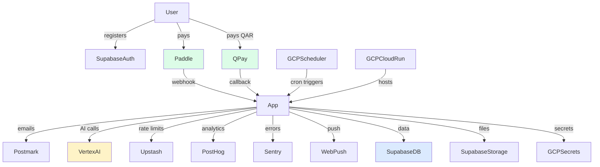

# Hayya Med Pro — Integration Matrix
_Generated: 2026-06-15_

---

## Integration Status Summary

| Integration | Status | Env Var | Notes |
|------------|--------|---------|-------|
| **AI / Gemini** | ✅ Ready | GCP ADC | Vertex AI (Gemini Flash Lite) — no API key needed; Claude/Anthropic removed 2026-07-04 |
| **Supabase DB** | ✅ Ready | `NEXT_PUBLIC_SUPABASE_URL`, `NEXT_PUBLIC_SUPABASE_ANON_KEY`, `SUPABASE_SERVICE_ROLE_KEY` | All configured |
| **Supabase Auth** | ✅ Ready | (same) | Email + magic link + TOTP MFA + passkeys |
| **Supabase Storage** | ✅ Ready | (same) | Private bucket for certificates |
| **Paddle Payments** | ✅ Ready | `PADDLE_SECRET_KEY`, `PADDLE_WEBHOOK_SECRET`, `PADDLE_PRO_MONTHLY_PRICE_ID`, `PADDLE_PRO_ANNUAL_PRICE_ID`, `PADDLE_EMPLOYER_PRICE_IDS` | Webhook handler live |
| **QPay (Qatar)** | ✅ Ready | `QPAY_USERNAME`, `QPAY_PASSWORD`, `QPAY_BASE_URL` | QR invoice creation + callback |
| **Postmark Email** | ✅ Ready | `POSTMARK_SERVER_API_TOKEN` | Transactional only; approval needed |
| **Web Push** | ✅ Ready | `NEXT_PUBLIC_VAPID_PUBLIC_KEY`, `VAPID_PRIVATE_KEY` | Web Push VAPID |
| **PostHog Analytics** | ✅ Ready | `NEXT_PUBLIC_POSTHOG_KEY` | US region host |
| **Sentry Error** | ✅ Ready | `SENTRY_DSN` | Tunnel at `/monitoring` |
| **Upstash Redis** | ✅ Ready | `UPSTASH_REDIS_REST_URL`, `UPSTASH_REDIS_REST_TOKEN` | Rate limiting |
| **GCP Cloud Run** | ✅ Ready | GCP project + ADC | me-central1 (Doha) |
| **GCP Cloud Scheduler** | ✅ Ready | (GCP project) | 7 cron jobs configured + enabled |
| **GCP Secret Manager** | ✅ Ready | (GCP project) | All secrets stored |
| **Apple Pay** | 🔴 Missing | — | Not implemented |
| **Google Pay** | 🔴 Missing | — | Not implemented |
| **SMS (Twilio/etc)** | 🔴 Missing | — | Not implemented |
| **FCM (Android Push)** | 🔴 Missing | — | For React Native app |
| **APNs (iOS Push)** | 🔴 Missing | — | For React Native app |
| **Google/Apple Calendar** | 🔴 Missing | — | `.ics` download exists but no direct calendar sync |
| **HRIS / HR Systems** | 🔴 Missing | — | Enterprise integration (Workday, SAP) |
| **QR Verification (Public)** | ✅ Ready | — | `/p/[id]` public profile + QR code |

---

## Detail: AI / Gemini (Vertex AI)

### Architecture
```
Cloud Run (Next.js)
  └─> Vertex AI client (lib/ai/providers/gemini.ts, lib/ai/complete.ts)
        └─> Google Cloud Vertex AI
              └─> Gemini Flash Lite (gemini-2.5-flash-lite)
```

### Implementation
```typescript
// lib/ai/providers/gemini.ts
import { VertexAI } from "@google-cloud/vertexai";

function getVertex(): VertexAI {
  return new VertexAI({ project: process.env.GOOGLE_CLOUD_PROJECT, location: "us-east5" });
}
```

### Status: ✅ All AI routes use this client — single provider, Claude/Anthropic fully removed (2026-07-04, including the `@anthropic-ai/sdk` and `@anthropic-ai/vertex-sdk` packages)

### Blockers
- User must enable Vertex AI API in GCP console
- User must grant `roles/aiplatform.user` to Cloud Run service account

---

## Detail: Supabase

### Client Pattern
| Context | Import | Function |
|---------|--------|----------|
| Browser/Client Component | `@/lib/supabase/client` | `createClient()` |
| Server Component / API Route | `@/lib/supabase/server` | `await createClient()` |
| Admin (bypasses RLS) | `@/lib/supabase/server` | `createAdminClient()` |

### Storage Architecture
```
Supabase Storage Buckets:
  certificates/                 ← Private bucket
    {user_id}/
      {cme_activity_id}/
        certificate.{ext}
  
  profile-photos/               ← (future) Public bucket
    {user_id}/avatar.{ext}
  
  course-materials/             ← (future) Private bucket
    {provider_id}/{course_id}/
      materials/
```

### RLS on Storage
- `certificates` bucket: Only owner can read via signed URL (1-hour expiry)
- Admin reads via `createAdminClient()` for verification queue

---

## Detail: Paddle Payments

### Webhook Events Handled

| Event | Handler | Action |
|-------|---------|--------|
| `subscription.activated` | `/api/paddle/webhooks` | UPDATE subscriptions plan/status |
| `subscription.updated` | `/api/paddle/webhooks` | UPDATE current_period_end |
| `subscription.cancelled` | `/api/paddle/webhooks` | UPDATE cancel_at_period_end=true |
| `transaction.payment_failed` | `/api/paddle/webhooks` | UPDATE status=past_due; send email |
| `transaction.completed` (one-time) | `/api/paddle/webhooks` | Handle one-time purchases |

### Missing Webhook Handlers
- `subscription.past_due` — not explicitly handled (covered by `payment_failed`)
- `customer.updated` — email changes not reflected in profiles
- `subscription.trial_started` — no specific handler (trial tracked by `is_trial` column)

### Price ID Management
Stored in `cloudbuild.yaml` as substitution variables and in GCP Secret Manager. Not hardcoded in application code. ✅

---

## Detail: Postmark Email

### Templates (Transactional)

| Template | Trigger | Status |
|----------|---------|--------|
| CME Activity Verified | Admin verifies activity | ✅ Live |
| CME Activity Rejected | Admin rejects activity | ✅ Live |
| License Expiry (90/30/7 days) | Cron job | ✅ Live |
| CME Deadline Reminder | Cron job | ✅ Live |
| Pro Trial Ending | Cron job | ✅ Live |
| Pro Trial Expired | Cron job | ✅ Live |
| Subscription Upgraded | Paddle webhook | ✅ Live |
| Payment Failed | Paddle webhook | ✅ Live |
| Employer Task Assigned | Employer admin | ✅ Live |
| Employer Weekly Digest | Cron job | ✅ Live |
| Onboarding Drip (D+1,3,7,10) | Cron job | ✅ Live |
| Bounce protection | Postmark webhook | ✅ Live |
| One-click unsubscribe | Link in footer | ✅ Live |

### Missing Email Templates
- Welcome email (immediate on signup)
- Referral reward email
- Certificate verification confirmation
- Password change confirmation
- MFA enabled/disabled confirmation

---

## Detail: QPay (Qatar Local Payment)

### Flow
```
POST /api/qpay/create-invoice
  → QPay API: create_simple_invoice
  → Returns: qr_text, short_url, invoice_id
  → INSERT qpay_invoices (status=pending)
  → Display QR code to user

POST /api/qpay/callback (webhook from QPay)
  → Verify payment: check_payment_status
  → UPDATE qpay_invoices (status=paid)
  → UPDATE subscriptions (plan=pro)
```

### Status: ✅ Live

### Blockers
- QPay production credentials needed (currently test environment)

---

## Detail: Web Push Notifications

### Architecture
```
Browser:
  navigator.serviceWorker.register('/sw.js')
  PushManager.subscribe({applicationServerKey: VAPID_PUBLIC_KEY})
  → POST /api/push with {endpoint, p256dh, auth}
  → INSERT push_subscriptions

Server (cron / admin):
  Fetch push_subscriptions for target users
  web-push.sendNotification(subscription, payload)
  → Browser receives notification even when app is closed
```

### Topics Supported
- License expiry reminders (cron: license-reminders)
- Admin broadcast (POST /api/admin/push-broadcast)
- (Future) CME deadline push
- (Future) Activity verification result push

---

## Missing Integrations — Priority Roadmap

### Priority 1: FCM / APNs for Mobile

Required before React Native app launch.

```typescript
// Needed: mobile_device_registrations table (migration 043)
// Needed: Firebase Admin SDK for FCM
// Needed: Apple APNs HTTP/2 provider

// lib/push-mobile.ts
export async function sendFCMPush(token: string, notification: PushPayload) {
  // Firebase Admin SDK
}
export async function sendAPNsPush(deviceToken: string, notification: PushPayload) {
  // node-apn or @parse/node-apn
}
```

### Priority 2: Apple Pay / Google Pay

Required for mobile app subscription revenue (web checkout only — bypasses App Store 30% fee).

```
Paddle supports Apple Pay and Google Pay on web checkout.
React Native: WebView-based checkout pointing to /checkout?plan=pro
No native in-app purchase SDK needed.
```

### Priority 3: SMS (Twilio)

For markets where email open rates are low (certain GCC populations prefer SMS for critical reminders).

```
Use case: License expiry final 7-day warning via SMS
Provider: Twilio (global) or Unifonic (GCC-native, better deliverability in Saudi/UAE)
```

### Priority 4: Calendar Sync

`.ics` file download exists for individual events. Direct calendar sync (Google Calendar API, Outlook API) would enable automatic license renewal reminders in calendar.

```
POST /api/calendar/sync
→ Generate iCalendar feed URL
→ User subscribes feed in Google Calendar
→ Events auto-update when dates change
```

### Priority 5: HRIS Webhook (Enterprise)

For hospital HR systems (Workday, SAP HCM, Oracle HCM):

```
POST /api/webhooks/hris-sync
  → Receives employee compliance status changes
  → Maps to professional_profiles via email
  → Creates employer_link_requests automatically
```

---

## Integration Dependencies Map



