# Hayya Med Pro — Workflow & Automation Architecture
_Generated: 2026-06-15_

---

## 1. User Registration & Profile Creation

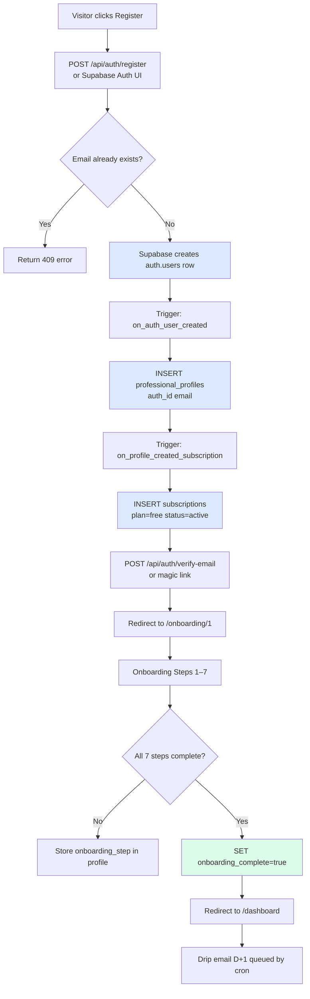

**Automations triggered:**
- `handle_new_user()` DB trigger → creates `professional_profiles`
- `handle_new_subscription()` DB trigger → creates free `subscriptions` row
- `drip_email_log` cron (D+1, D+3, D+7, D+10) → onboarding activation emails

**Missing automation:** Welcome email sent immediately on profile creation (currently only drip D+1)

---

## 2. Employer / Organisation Onboarding

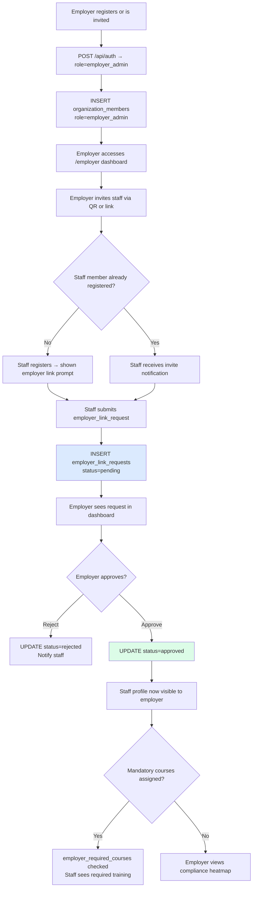

**Missing automation:** No webhook fired when employer approves a link request (enterprise integrations need this)

---

## 3. CME Activity Submission & Verification

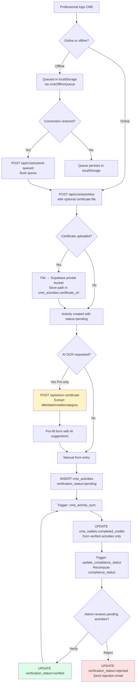

**Missing automation:**
- Auto-verify activities from known accredited providers (marketplace completions are auto-verified)
- No AI confidence score stored for OCR extraction quality

---

## 4. Course Enrollment & Completion (Marketplace)

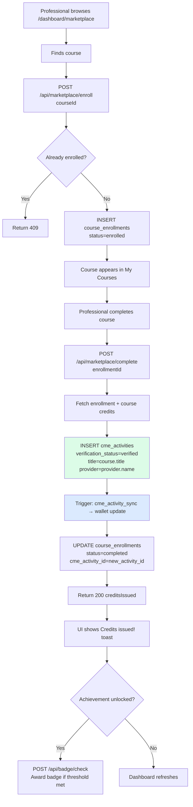

---

## 5. Subscription Lifecycle (Paddle)

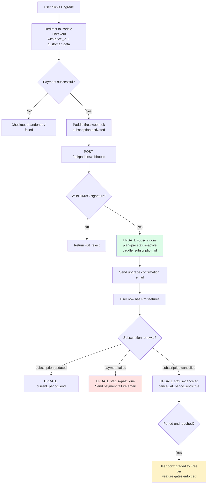

**QPay alternative (Qatar):**
```mermaid
flowchart LR
    A[User selects QPay] --> B[POST /api/qpay/create-invoice]
    B --> C[INSERT qpay_invoices\nstatus=pending]
    C --> D[Show QR code to user]
    D --> E[User scans QR in banking app]
    E --> F[QPay fires callback webhook]
    F --> G[POST /api/qpay/callback]
    G --> H[UPDATE qpay_invoices\nstatus=paid]
    H --> I[UPDATE subscriptions\nplan=pro]
```

---

## 6. Compliance Monitoring (Automated)

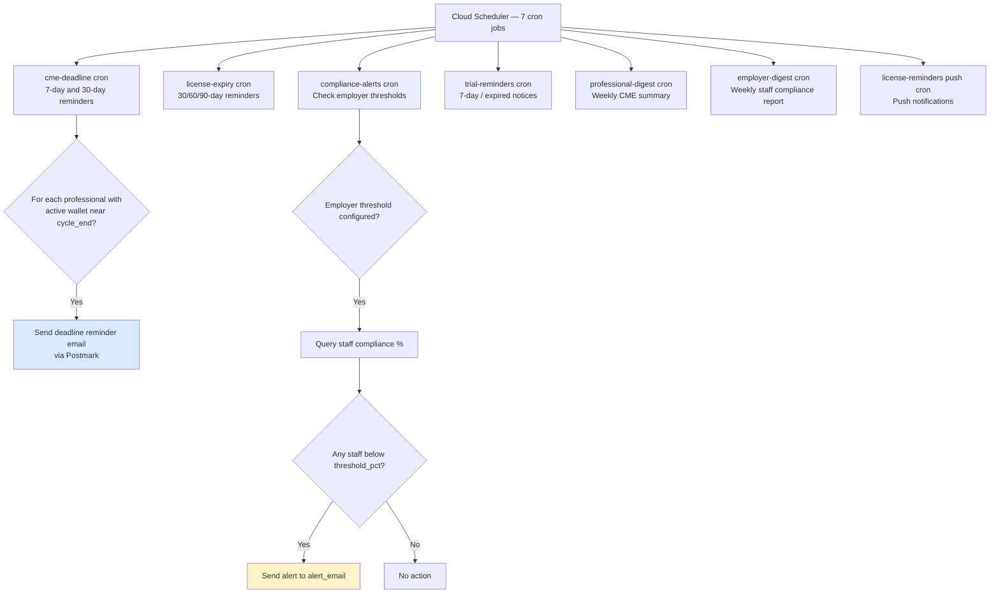

**Missing automation:**
- No real-time compliance score push when activity is verified (only recalculated on wallet write)
- No automated re-enrollment reminder for employer_required_courses with due dates

---

## 7. AI Certificate OCR Flow

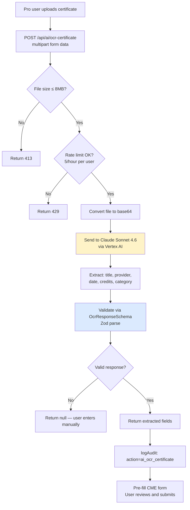

---

## 8. Renewal Tracking & License Management

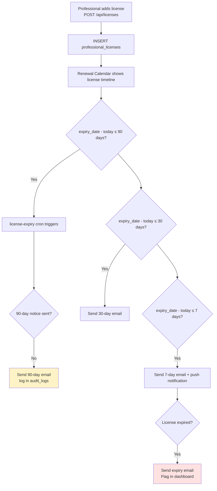

---

## 9. Referral Programme

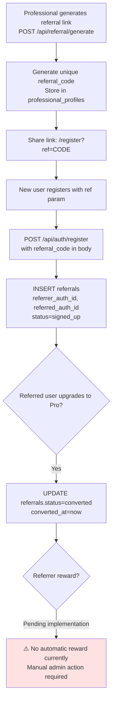

**Missing:** Referral reward automation — discount, trial extension, or free month for referrer on conversion

---

## 10. Push Notification Flow

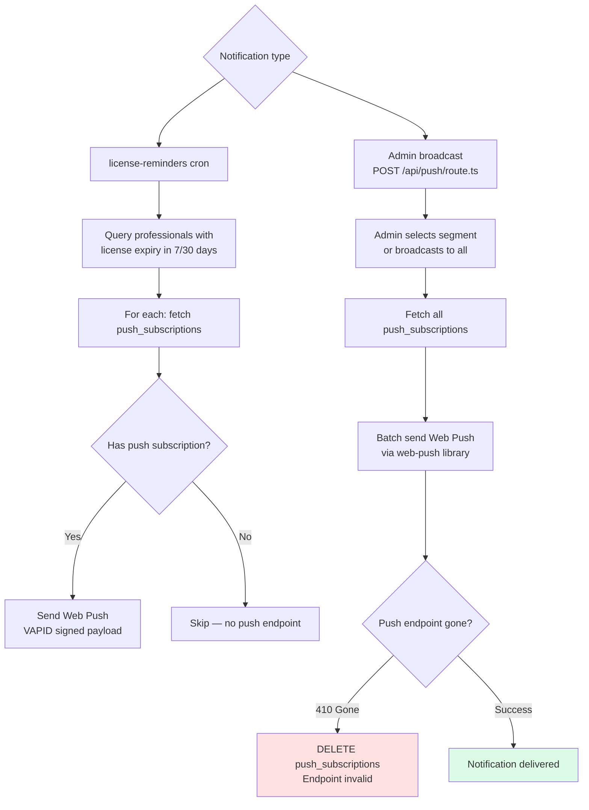

---

## 11. Drip Email Onboarding Sequence

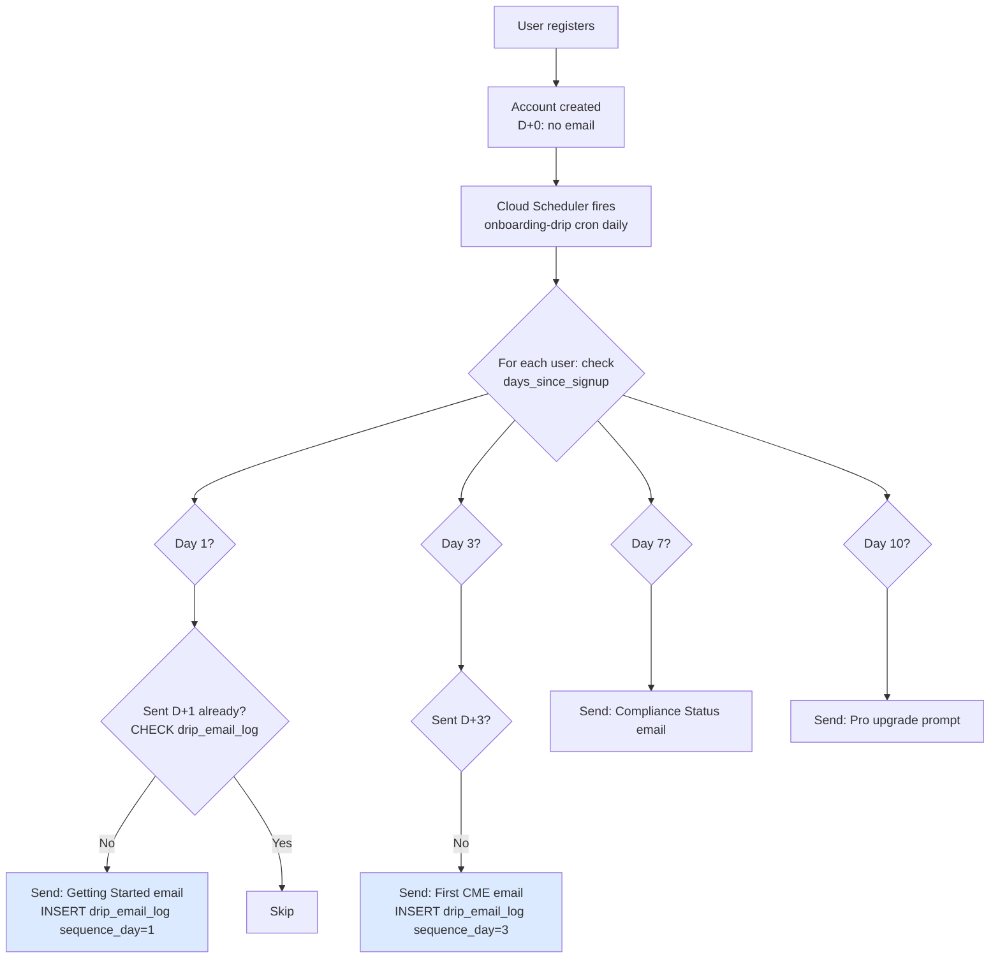

---

## 12. MFA / Security Flow

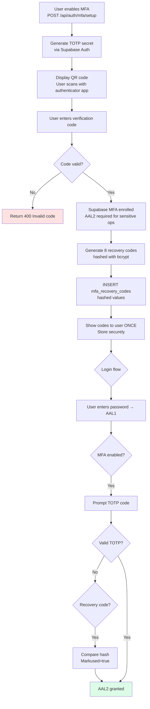

---

## Automation Gaps Summary

| Gap | Priority | Impact |
|-----|----------|--------|
| No immediate welcome email on registration | MEDIUM | Activation rate |
| No referral reward automation | HIGH | Growth / viral loop |
| No real-time compliance push on activity verify | LOW | UX polish |
| No employer webhook on link approval | HIGH | Enterprise integration |
| No retry/queue for failed emails | HIGH | Reliability |
| No auto-verify for known accredited providers | MEDIUM | UX friction |
| No post-renewal congratulation email | LOW | Retention |
| No employer_required_courses deadline alerts | MEDIUM | Employer value |

